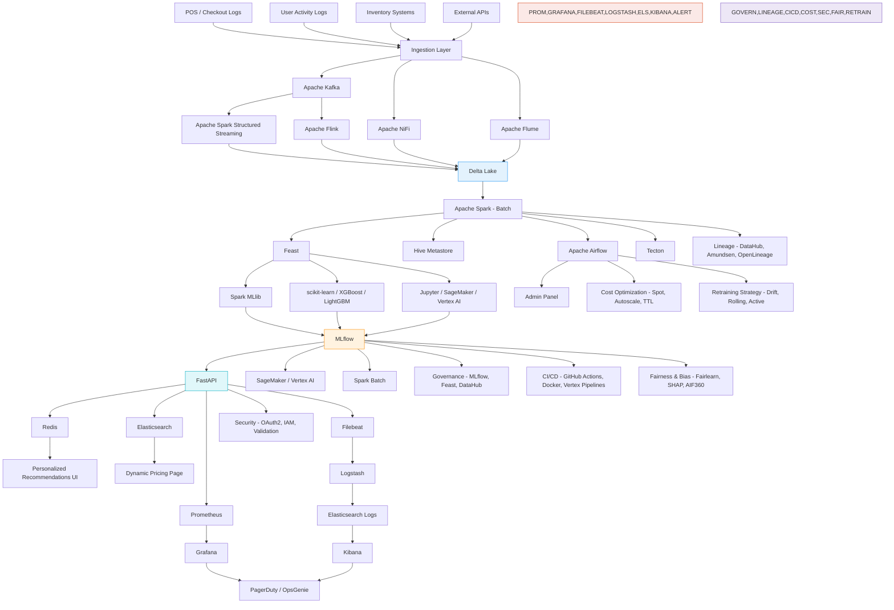

```mermaid

graph TD

%% Data Sources
DS1[POS / Checkout Logs] --> IN
DS2[User Activity Logs] --> IN
DS3[Inventory Systems] --> IN
DS4[External APIs] --> IN

%% Ingestion Layer
IN[Ingestion Layer] --> KAFKA[Apache Kafka]
IN --> NIFI[Apache NiFi]
IN --> FLUME[Apache Flume]

%% Streaming Layer
KAFKA --> STREAM1[Apache Spark Structured Streaming]
KAFKA --> STREAM2[Apache Flink]

%% Data Lake & Batch
STREAM1 --> DL[Delta Lake]
STREAM2 --> DL
NIFI --> DL
FLUME --> DL
DL --> BATCH[Apache Spark - Batch]
BATCH --> AIRFLOW[Apache Airflow]
BATCH --> METASTORE[Hive Metastore]

%% Feature Store
BATCH --> FEAST[Feast]
BATCH --> TECTON[Tecton]

%% Modeling & Training
FEAST --> MLLIB[Spark MLlib]
FEAST --> SKLEARN[scikit-learn / XGBoost / LightGBM]
FEAST --> ENV[Jupyter / SageMaker / Vertex AI]
MLLIB --> MLFLOW[MLflow]
SKLEARN --> MLFLOW
ENV --> MLFLOW

%% Model Deployment
MLFLOW --> FASTAPI[FastAPI]
MLFLOW --> SMVAI[SageMaker / Vertex AI]
MLFLOW --> SPARKBATCH[Spark Batch]

%% Serving Layer
FASTAPI --> REDIS[Redis]
FASTAPI --> ES[Elasticsearch]

%% UI Layer
REDIS --> RECOUI[Personalized Recommendations UI]
ES --> PRICEUI[Dynamic Pricing Page]
AIRFLOW --> ADMIN[Admin Panel]

%% Monitoring, Logging, Alerting
FASTAPI --> PROM[Prometheus]
FASTAPI --> FILEBEAT[Filebeat]
PROM --> GRAFANA[Grafana]
FILEBEAT --> LOGSTASH[Logstash]
LOGSTASH --> ELS[Elasticsearch Logs]
ELS --> KIBANA[Kibana]
GRAFANA --> ALERT[PagerDuty / OpsGenie]
KIBANA --> ALERT

%% Governance & Lineage
MLFLOW --> GOVERN[Governance - MLflow, Feast, DataHub]
BATCH --> LINEAGE[Lineage - DataHub, Amundsen, OpenLineage]

%% CI/CD
MLFLOW --> CICD[CI/CD - GitHub Actions, Docker, Vertex Pipelines]

%% Cost Optimization
AIRFLOW --> COST[Cost Optimization - Spot, Autoscale, TTL]

%% Security, Fairness, Retraining
FASTAPI --> SEC[Security - OAuth2, IAM, Validation]
MLFLOW --> FAIR[Fairness & Bias - Fairlearn, SHAP, AIF360]
AIRFLOW --> RETRAIN[Retraining Strategy - Drift, Rolling, Active]

%% Styling (Optional, remove if plain Mermaid is preferred)
style DL fill:#e3f2fd,stroke:#2196f3
style MLFLOW fill:#fff3e0,stroke:#fb8c00
style FASTAPI fill:#e0f7fa,stroke:#00acc1
style PROM,GRAFANA,FILEBEAT,LOGSTASH,ELS,KIBANA,ALERT fill:#fbe9e7,stroke:#d84315
style GOVERN,LINEAGE,CICD,COST,SEC,FAIR,RETRAIN fill:#ede7f6,stroke:#7e57c2
```
