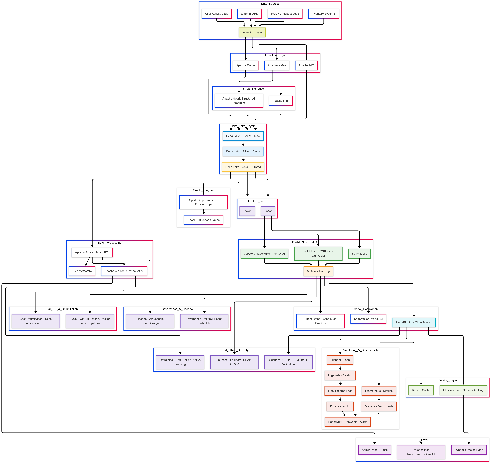

# Main Architecture



* * *

# File Structure

```
📦 .github  
 ┗━━ 📂 workflows  
     ┣━━ 📝 build_simulator.yml


📦 data_sources                 # Raw data generation (POS logs, clickstreams, etc.)
 ┣━━ 📂 pos_logs
 ┃   ┣━━ simulate_pos.py              # Simulates checkout/transaction logs
 ┃   ┗━━ pos_events.json              # Sample events used in simulations
 ┣━━ 📂 user_activity
 ┃   ┣━━ generate_clickstream.py      # Simulates user clicks & web activity
 ┃   ┗━━ activity_events.csv          # Sample clickstream data
 ┣━━ 📂 inventory
 ┃   ┗━━ inventory_feed.py            # Inventory API mock (SKU/stock data)
 ┗━━ 📂 external_apis
     ┣━━ weather_feed.py              # Simulates weather API responses
     ┣━━ pricing_scraper.py           # Pulls competitor pricing
     ┗━━ promotions_feed.py           # Pulls marketing or campaign offers


📦 ingestion_layer            # Ingest data from producers to streaming systems
 ┣━━ 📂 kafka
 ┃   ┣━━ docker-compose.yml          # Spins up Kafka + Zookeeper cluster
 ┃   ┣━━ 📂 config
 ┃   ┃   ┗━━ server.properties        # Kafka broker settings
 ┃   ┣━━ 📂 topics
 ┃   ┃   ┗━━ create_topics.py         # Creates Kafka topics programmatically
 ┣━━ 📂 nifi
 ┃   ┣━━ 📂 flows
 ┃   ┃   ┗━━ ecommerce_data_flow.xml  # Nifi drag-drop pipeline definition
 ┃   ┣━━ 📂 processors
 ┃   ┃   ┗━━ api_fetch_processor.py   # Custom processor to ingest APIs
 ┃   ┗━━ Dockerfile                   # Builds Nifi Docker image
 ┗━━ 📂 flume
     ┣━━ 📂 conf
     ┃   ┗━━ flume_agent.conf         # Log collection config (e.g., syslog)
     ┣━━ 📂 input_logs
     ┗━━ Dockerfile


📦 stream_processing          # Real-time processing & enrichment
 ┣━━ 📂 spark_streaming
 ┃   ┣━━ 📂 streaming_jobs
 ┃   ┃   ┣━━ process_clickstream.py       # Parses and filters clickstream data
 ┃   ┃   ┣━━ enrich_transaction.py        # Adds external context (e.g., weather)
 ┃   ┃   ┗━━ create_realtime_features.py  # Feature engineering in real-time
 ┃   ┣━━ 📂 config
 ┃   ┃   ┗━━ spark_defaults.conf          # Spark runtime configs
 ┃   ┣━━ 📂 resources/schemas
 ┃   ┃   ┗━━ click_event_schema.json      # JSON schema for incoming events
 ┃   ┗━━ Dockerfile
 ┗━━ 📂 flink_python
     ┣━━ 📂 cep_jobs
     ┃   ┗━━ fraud_pattern_detector.py    # Complex event pattern detection (CEP)
     ┣━━ 📂 windows
     ┃   ┗━━ session_aggregator.py        # Aggregates sessions (time windowing)
     ┗━━ Dockerfile


📦 data_lake                 # Raw and refined historical storage
 ┣━━ 📂 delta_lake
 ┃   ┣━━ 📂 bronze                   # Stores raw ingested data
 ┃   ┣━━ 📂 silver                   # Cleaned/filtered data
 ┃   ┗━━ 📂 gold                     # Business-level analytics tables
 ┣━━ 📂 hive_metastore
 ┃   ┣━━ 📂 schema
 ┃   ┃   ┗━━ ddl_create_tables.sql      # Table creation for Spark SQL
 ┃   ┣━━ 📂 conf
 ┃   ┃   ┗━━ hive-site.xml              # Connects Hive with Delta tables
 ┃   ┗━━ Dockerfile
 ┗━━ 📂 minio_s3
     ┣━━ docker-compose.yml
     ┣━━ 📂 buckets
     ┃   ┗━━ delta-lake/                # S3 bucket for Delta table storage
     ┗━━ access_credentials.env


📦 batch_processing          # Offline data transformations
 ┣━━ 📂 spark_jobs
 ┃   ┣━━ aggregate_product_views.py     # Daily aggregations
 ┃   ┣━━ calculate_churn_features.py    # Feature generation for modeling
 ┃   ┣━━ join_bronze_to_silver.py       # ETL bronze to cleaned silver layer
 ┃   ┗━━ output_to_gold.py              # Final output to business tables
 ┣━━ 📂 pipeline_configs
 ┃   ┗━━ daily_aggregates.yml           # Job-level config (used by CLI/Airflow)
 ┗━━ Dockerfile


📦 airflow_orchestration     # DAG automation for batch and ML workflows
 ┣━━ 📂 dags
 ┃   ┣━━ etl_clickstream_dag.py        # DAG for data ingestion and transformation
 ┃   ┣━━ train_model_dag.py            # DAG for training models on schedule
 ┃   ┣━━ model_monitoring_dag.py       # DAG for detecting drift and anomalies
 ┃   ┗━━ retrain_on_drift_dag.py       # DAG that retrains models on drift triggers
 ┣━━ 📂 plugins
 ┃   ┣━━ 📂 operators
 ┃   ┃   ┗━━ mlflow_register_operator.py
 ┃   ┣━━ 📂 hooks
 ┃   ┃   ┗━━ feast_feature_store_hook.py
 ┃   ┣━━ 📂 sensors
 ┃   ┃   ┗━━ delta_ingestion_sensor.py
 ┣━━ 📂 configs
 ┃   ┗━━ airflow.cfg
 ┣━━ Dockerfile
 ┗━━ docker-compose.yml


📦 feature_store             # Manages feature generation, storage & retrieval
 ┣━━ 📂 feature_repo
 ┃   ┣━━ 📂 driver_stats
 ┃   ┃   ┣━━ driver_hourly_stats.py        # Real-time aggregation features
 ┃   ┃   ┗━━ driver_churn_features.py      # Features related to churn modeling
 ┃   ┣━━ 📂 data_sources
 ┃   ┃   ┗━━ kafka_config.py               # Kafka topic & source config
 ┃   ┗━━ feature_store.yaml                # Feast feature repo config
 ┣━━ 📂 online_store
 ┃   ┗━━ 📂 redis
 ┃       ┣━━ Dockerfile                    # Redis container for online retrieval
 ┃       ┗━━ redis.conf                    # Redis setup for fast reads
 ┗━━ 📂 offline_store
     ┗━━ parquet_data                      # Offline feature snapshots for training


📦 ml_modeling               # End-to-end ML pipeline: train → evaluate → register
 ┣━━ 📂 training_scripts
 ┃   ┣━━ train_xgboost.py                 # XGBoost training code
 ┃   ┣━━ train_lightgbm.py               # LightGBM training code
 ┃   ┣━━ model_selection.py              # Compares different models/metrics
 ┃   ┣━━ run_pipeline.py                 # Main training entrypoint (CLI or DAG)
 ┃   ┗━━ model_config.yaml               # Hyperparameters and model metadata
 ┣━━ 📂 preprocessing
 ┃   ┣━━ clean_features.py               # Preprocessing & NA handling
 ┃   ┣━━ encode_categoricals.py          # One-hot, label encoding, etc.
 ┃   ┗━━ feature_selector.py             # Feature selection using filters or SHAP
 ┣━━ 📂 evaluation
 ┃   ┣━━ metrics.py                      # Evaluation metrics: AUC, precision, etc.
 ┃   ┣━━ explainability.py               # SHAP/LIME explanations
 ┃   ┗━━ fairness_audit.py               # Bias & fairness checks
 ┣━━ 📂 registry
 ┃   ┣━━ register_with_mlflow.py         # Registers best model to MLflow
 ┃   ┣━━ register_in_airflow.py          # Triggers registry from Airflow DAG
 ┃   ┗━━ tag_best_model.py               # Tags model version (production/candidate)
 ┗━━ Dockerfile


📦 mlflow_tracking           # Experiment tracking and artifact logging
 ┣━━ 📂 server
 ┃   ┣━━ start_server.sh                # Starts local MLflow tracking UI
 ┃   ┣━━ 📂 mlruns                      # Stores experiments, runs, metrics
 ┃   ┗━━ Dockerfile
 ┣━━ 📂 configs
 ┃   ┣━━ backend_store.db               # SQLite or DB backend store
 ┃   ┗━━ mlflow_env.yaml                # MLflow environment config
 ┗━━ 📂 notebooks
     ┗━━ view_experiments.ipynb         # View and compare runs in Jupyter


📦 model_serving             # Serve models as APIs using FastAPI
 ┣━━ 📂 fastapi_server
 ┃   ┣━━ main.py                        # Entrypoint: launches FastAPI server
 ┃   ┣━━ predict.py                     # Defines /predict route logic
 ┃   ┣━━ model_loader.py                # Loads MLflow model
 ┃   ┣━━ feature_fetcher.py             # Queries Feast online store
 ┃   ┣━━ schemas.py                     # Request/response Pydantic models
 ┃   ┣━━ logger.py                      # Structured request/response logs
 ┃   ┣━━ test_predict.py                # Unit test for prediction endpoint
 ┃   ┣━━ Dockerfile
 ┃   ┗━━ requirements.txt
 ┗━━ 📂 redis_cache
     ┣━━ redis.conf                     # Redis used to store recent predictions
     ┗━━ Dockerfile


📦 ui_layer                  # Frontend interfaces: admin + user UI
 ┣━━ 📂 flask_admin_panel
 ┃   ┣━━ app.py                        # Flask app launcher
 ┃   ┣━━ 📂 routes
 ┃   ┃   ┣━━ pricing.py                # Admin pricing override endpoint
 ┃   ┃   ┗━━ recommendations.py        # Manual recommendations
 ┃   ┣━━ 📂 templates
 ┃   ┃   ┗━━ index.html                # Dashboard view
 ┃   ┣━━ 📂 static
 ┃   ┣━━ settings.py
 ┃   ┗━━ Dockerfile
 ┗━━ 📂 react_frontend
     ┣━━ 📂 public
     ┣━━ 📂 src
     ┃   ┣━━ App.js
     ┃   ┣━━ api.js                    # Axios wrapper to call FastAPI backend
     ┃   ┗━━ 📂 components
     ┃       ┗━━ RecommendationCard.js
     ┣━━ package.json
     ┗━━ Dockerfile


📦 monitoring_logging        # Observability stack: metrics, logs, and alerts
 ┣━━ 📂 prometheus
 ┃   ┣━━ prometheus.yml               # Scrapes FastAPI, Airflow, etc.
 ┃   ┗━━ 📂 rules
 ┃       ┗━━ ...                      # Custom alert rules (e.g., latency, 5xx)
 ┣━━ 📂 grafana
 ┃   ┣━━ 📂 dashboards
 ┃   ┃   ┣━━ latency_metrics.json     # Visualize API/DB latency
 ┃   ┃   ┗━━ model_accuracy.json      # Visual ML model performance
 ┃   ┗━━ 📂 datasources
 ┃       ┗━━ prometheus.yaml          # Prometheus datasource for Grafana
 ┣━━ 📂 elasticsearch
 ┃   ┗━━ elasticsearch.yml            # Stores application logs
 ┣━━ 📂 kibana
 ┃   ┗━━ kibana.yml                   # Frontend to explore logs and visualize patterns
 ┣━━ 📂 filebeat
 ┃   ┗━━ filebeat.yml                 # Ships logs from containers to Elasticsearch
 ┗━━ 📂 alerting
     ┣━━ pagerduty_webhook.sh         # Sends alerts to PagerDuty
     ┗━━ opsgenie_notifier.py         # Sends alerts to Opsgenie


📦 production_ops           # All operational controls: security, governance, drift
 ┣━━ 📂 security
 ┃   ┣━━ 📂 secrets
 ┃   ┃   ┣━━ .env.secrets.template    # Template for secret loading
 ┃   ┃   ┣━━ k8s-secrets.yaml         # Kubernetes-managed secrets
 ┃   ┃   ┗━━ vault_policy.hcl         # Vault policy for secret access
 ┃   ┣━━ 📂 auth
 ┃   ┃   ┣━━ oauth2_fastapi_middleware.py  # Token-based auth middleware
 ┃   ┃   ┗━━ token_verifier.py
 ┃   ┣━━ 📂 tls
 ┃   ┃   ┣━━ generate_cert.sh         # SSL cert generation
 ┃   ┃   ┗━━ nginx_ssl.conf           # SSL configuration for NGINX
 ┃   ┗━━ 📂 validation
 ┃       ┣━━ input_schema.py          # Input request schema validation
 ┃       ┗━━ sanitization.py          # Clean up user inputs for security
 ┣━━ 📂 governance
 ┃   ┣━━ 📂 lineage
 ┃   ┃   ┣━━ openlineage_config.yaml  # Data lineage system integration
 ┃   ┃   ┣━━ dag_lineage_plugin.py    # Airflow plugin for OpenLineage
 ┃   ┃   ┗━━ mlflow_lineage_hook.py   # Logs model lifecycle lineage
 ┃   ┣━━ 📂 metadata
 ┃   ┃   ┣━━ datahub_ingest.py        # Pushes metadata to DataHub
 ┃   ┃   ┣━━ amundsen_config.py       # Metadata push to Amundsen
 ┃   ┃   ┗━━ schema_registry.json     # Avro/JSON schema registry
 ┃   ┗━━ 📂 policies
 ┃       ┗━━ data_retention.yaml      # Data retention + archival policies
 ┣━━ 📂 fairness_bias
 ┃   ┣━━ 📂 explainability
 ┃   ┃   ┣━━ shap_visualizer.py       # Visual SHAP explanation plots
 ┃   ┃   ┗━━ lime_summary_plot.py     # LIME-based local explanations
 ┃   ┣━━ 📂 fairness
 ┃   ┃   ┣━━ audit_report_generator.py # Generates fairness audit reports
 ┃   ┃   ┣━━ subgroup_evaluator.py     # Fairness across subgroups
 ┃   ┃   ┗━━ bias_metrics.py           # Metrics like demographic parity
 ┃   ┗━━ 📂 tests
 ┃       ┗━━ test_demographic_parity.py # Unit test for bias audits
 ┣━━ 📂 retraining
 ┃   ┣━━ 📂 drift_detection
 ┃   ┃   ┣━━ drift_detector.py         # Detects feature/model drift
 ┃   ┃   ┗━━ data_drift_dashboard.json # Visualizes drift metrics
 ┃   ┣━━ 📂 auto_retrain
 ┃   ┃   ┣━━ retrain_if_drift.py       # Auto-triggers retraining
 ┃   ┃   ┗━━ trigger_airflow_dag.py    # Kicks off Airflow DAG
 ┃   ┗━━ 📂 configs
 ┃       ┗━━ thresholds.yaml           # Drift thresholds and alerts
 ┣━━ 📂 optimization
 ┃   ┣━━ 📂 ttl_cleanups
 ┃   ┃   ┣━━ delta_ttl_purger.py       # Deletes expired delta tables
 ┃   ┃   ┗━━ airflow_cleanup.py        # DAG to delete old logs/checkpoints
 ┃   ┣━━ 📂 infra_savings
 ┃   ┃   ┣━━ spot_instance_checker.py  # Checks spot instance usage
 ┃   ┃   ┗━━ downscale_when_idle.py    # Auto-downscale idle services
 ┃   ┗━━ 📂 usage_reporting
 ┃       ┗━━ cost_summary_generator.py # Cloud usage and cost reporting


📦 ci_cd                     # All CI/CD workflows and automation scripts
 ┣━━ 📂 github_actions
 ┃   ┣━━ build_model.yml             # Builds and logs ML models to MLflow
 ┃   ┣━━ build_api.yml               # Lints + tests FastAPI code
 ┃   ┣━━ deploy_to_k8s.yml           # Pushes app to Kubernetes
 ┃   ┗━━ retrain_on_data_change.yml  # Optional: retrain trigger by new data
 ┣━━ 📂 scripts
 ┃   ┣━━ build_image.sh              # Docker image build utility
 ┃   ┣━━ push_to_registry.sh         # Push Docker image to registry
 ┃   ┣━━ deploy_stack.sh             # Orchestrates full-stack deploy
 ┃   ┗━━ notify_opsgenie.sh          # CI/CD failure alerting


📦 deployment                # Dev/staging/prod deployment manifests
 ┣━━ 📂 docker_compose
 ┃   ┣━━ full_stack_dev.yml          # Entire project: Dev stack in one go
 ┃   ┣━━ fastapi_only.yml            # For API testing in isolation
 ┃   ┣━━ airflow_stack.yml           # Standalone airflow stack for testing
 ┃   ┗━━ kafka_nifi_stack.yml        # Event pipeline containers
 ┣━━ 📂 kubernetes
 ┃   ┣━━ fastapi_deployment.yaml     # Deployment spec for model API
 ┃   ┣━━ model-serving-service.yaml  # Exposes model as Kubernetes service
 ┃   ┣━━ kafka-statefulset.yaml      # Kafka pod management
 ┃   ┣━━ redis-deployment.yaml       # Caches features/model output
 ┃   ┣━━ 📂 ingress
 ┃   ┃   ┗━━ ingress-routes.yaml     # Ingress routing configs
 ┃   ┣━━ 📂 secrets
 ┃   ┃   ┗━━ k8s-secrets.yaml        # Secrets for prod environment
 ┃   ┣━━ 📂 configmaps
 ┃   ┗━━ horizontal-pod-autoscaler.yaml # Enables autoscaling on load
 ┗━━ 📂 helm_charts
     ┣━━ airflow
     ┣━━ kafka
     ┣━━ model-serving
     ┗━━ grafana


📦 shared_utils              # Common helper libraries for reuse
 ┣━━ logging_config.py              # Standard logging config across services
 ┣━━ kafka_helpers.py               # Common Kafka utility functions
 ┣━━ s3_utils.py                    # MinIO or AWS S3 interactions
 ┣━━ db_connection.py              # Reusable DB connection logic
 ┣━━ time_utils.py                 # Timestamp formatting, delays
 ┗━━ __init__.py


📦 contracts                 # Event schemas and validation for data quality
 ┣━━ 📂 schemas
 ┃   ┣━━ click_event.schema.json    # Defines schema for user click event
 ┃   ┗━━ transaction_event.schema.json # Schema for POS transaction events
 ┗━━ 📂 validators
     ┗━━ validate_kafka_event.py     # Ensures Kafka messages follow schemas


📦 config                    # All environment-specific configs
 ┣━━ dev.env                         # Dev environment variables
 ┣━━ staging.env                     # Staging environment variables
 ┣━━ prod.env                        # Production secrets & configs
 ┣━━ default_config.yaml             # Shared default configs
 ┗━━ model_params_dev.yaml           # ML model training/test settings


📦 tests                     # End-to-end project test coverage
 ┣━━ 📂 unit
 ┃   ┗━━ test_model_serving.py       # Unit test for model API
 ┣━━ 📂 integration
 ┃   ┗━━ test_etl_end_to_end.py      # Full ETL pipeline test
 ┣━━ 📂 load_tests
 ┃   ┗━━ locustfile.py               # Load testing FastAPI endpoints
 ┗━━ 📂 smoke_tests
     ┗━━ test_pipeline_smoke.py      # Minimal startup test for the pipeline


📦 research                  # Experiments, benchmarking, docs
 ┣━━ 📂 notebooks
 ┃   ┗━━ model_exploration.ipynb     # Data science exploration notebook
 ┣━━ 📂 whiteboard_diagrams
 ┃   ┗━━ retraining_loop.png         # Architecture visual for retraining
 ┣━━ 📂 benchmarks
 ┃   ┗━━ model_latency.csv           # Performance metrics tracking
 ┗━━ 📂 discarded
     ┗━━ old_feature_selection.py    # Deprecated or old logic


📦 runbooks                  # Operational guides for support
 ┣━━ how_to_fix_s3_access.md        # MinIO/S3 troubleshooting steps
 ┣━━ airflow_failure_coe.md         # Correction of Error (COE) for DAG issues
 ┗━━ model_drift_rca_2024_04.md     # RCA for model drift in April

```


* * *

# Choice of Tools 

### 🔷 **1\. Data Sources**

| Tool/Source | Purpose |
| --- | --- |
| POS / Checkout Logs | Structured sales transaction data |
| User Activity Logs | Clickstreams, search, session activity |
| Inventory Systems | Product catalog, SKU-level data |
| External APIs | Weather, competitor pricing, promotions |


* * *

### 🔶 **2\. Ingestion Layer**

| Tool | Purpose |
| --- | --- |
| **Apache Kafka** | Real-time stream of user events, transactions |
| **Apache NiFi** | API polling, batch ingestion, ETL routing |
| **Apache Flume** | Optional: file-based log ingestion |


* * *

### 🔸 **3\. Streaming Layer**

| Tool | Purpose |
| --- | --- |
| **Apache Spark Structured Streaming** | Real-time transformations, joins, aggregations |
| **Apache Flink** | Complex Event Processing (CEP), session windows |


* * *

### 🟦 **4\. Data Lake Layer**

| Tool | Purpose |
| --- | --- |
| **Delta Lake - Bronze** | Raw data lake (unprocessed streams, batch) |
| **Delta Lake - Silver** | Cleaned, deduplicated, structured |
| **Delta Lake - Gold** | Curated, analytics-ready datasets |


* * *

### 🟩 **5\. Batch Processing**

| Tool | Purpose |
| --- | --- |
| **Apache Spark (Batch)** | Batch ETL, feature pipelines, transforms |
| **Apache Airflow** | Workflow orchestration, retries, scheduling |
| **Hive Metastore** | Table metadata store for Spark, Presto, etc. |


* * *

### 🟪 **6\. Feature Store**

| Tool | Purpose |
| --- | --- |
| **Feast** | Open-source feature store (batch & online) |
| **Tecton** | Production-grade managed feature platform |


* * *

### 🟨 **7\. Modeling & Training**

| Tool | Purpose |
| --- | --- |
| **Spark MLlib** | Scalable collaborative filtering, ML pipelines |
| **scikit-learn / XGBoost / LightGBM** | Traditional ML models |
| **Jupyter / SageMaker / Vertex AI** | Experimentation, model development |
| **MLflow** | Model tracking, versioning, experiment logs |

* * *

### 💗 **8\. Graph Analytics**

| Tool | Purpose |
| --- | --- |
| **Spark GraphFrames** | Entity relationships, connected components, influence analysis |
| **Neo4j** | Graph database for personalized recommendations, fraud graphing |

* * *

### 🟦 **9\. Model Deployment**

| Tool | Purpose |
| --- | --- |
| **FastAPI** | Lightweight inference API |
| **SageMaker / Vertex AI** | Hosted endpoints, autoscaling, security |
| **Spark Batch** | Offline scoring, scheduled predictions |

* * *

### 🟢 **10\. Serving Layer**

| Tool | Purpose |
| --- | --- |
| **Redis** | Low-latency caching for session/personalization |
| **Elasticsearch** | Full-text search, ranked retrieval, logs |

* * *

### 💜 **11\. UI Layer**

| Component | Purpose |
| --- | --- |
| **Recommendations UI** | Personalized top-N product display |
| **Dynamic Pricing Page** | SKU/user/geo-specific pricing surface |
| **Admin Panel (Flask + SQLite/S3)** | Rule management, overrides |

* * *

### 🟧 **12\. Monitoring, Logging & Alerting**

| Tool | Purpose |
| --- | --- |
| **Prometheus** | Metrics collection |
| **Grafana** | Dashboards |
| **Filebeat** | Log shipping |
| **Logstash** | Log parsing and processing |
| **Elasticsearch** | Log indexing |
| **Kibana** | Log visualization |
| **PagerDuty / OpsGenie** | Incident response & alert routing |

* * *

### 🔐 **13\. Governance, Lineage, CI/CD, Cost**

| Area | Tools / Purpose |
| --- | --- |
| **Governance** | MLflow, Feast, DataHub |
| **Lineage** | OpenLineage, Amundsen |
| **CI/CD** | GitHub Actions, Docker, Vertex Pipelines |
| **Cost Optimization** | Spot instances, autoscaling, TTL policies |

* * *

### ⚖️ **14\. Security, Fairness, Retraining**

| Area | Tools / Practices |
| --- | --- |
| **Security** | OAuth2, IAM, secrets, TLS, input validation |
| **Fairness** | Fairlearn, SHAP, AIF360, What-If Tool |
| **Retraining** | Drift detection, rolling window, active learning, Airflow pipelines |

* * *

# End To End Production Ready Project Phases

* * *

## 🛠️ **PHASE 1: Foundational Setup**

### 🔹 Goal: Set up infrastructure, data collection, and real-time ingestion

| Step | Action | Tools | Output |
| --- | --- | --- | --- |
| 1.1 | Define your **use-cases**: recommendations, dynamic pricing, churn, fraud | Whiteboarding, interviews | Clear problem statements |
| 1.2 | Simulate or ingest **e-commerce data** (clickstream, POS, inventory, etc.) | Apache NiFi, APIs, flat files | Incoming raw data |
| 1.3 | Configure **real-time ingestion** | Apache Kafka, Apache Flume, NiFi | Clickstream and transaction pipelines |
| 1.4 | Create topics and routing logic | Kafka + NiFi processors | Streaming firehose |

✅ **Checkpoint:** Your pipeline is collecting structured + unstructured events in real time.

* * *

## 💡 **PHASE 2: Real-Time & Batch Processing**

### 🔹 Goal: Process data using both streaming and batch frameworks

| Step | Action | Tools | Output |
| --- | --- | --- | --- |
| 2.1 | Define **Bronze → Silver → Gold** Lake structure | Delta Lake (S3/HDFS) | Raw, clean, curated layers |
| 2.2 | Set up **Spark Structured Streaming** jobs | Spark + Delta | Streaming transformations |
| 2.3 | Use **Apache Flink** for sessionization, pattern detection | Flink | CEP-based stream analytics |
| 2.4 | Create **batch ETL pipelines** | Apache Spark (Batch) | Historical data aggregations |
| 2.5 | Orchestrate jobs & dependencies | Apache Airflow | Scheduled, monitored jobs |

✅ **Checkpoint:** Your raw events are cleaned, transformed, and stored in structured formats.

* * *

## 🔎 **PHASE 3: Feature Engineering & Data Modeling**

### 🔹 Goal: Prepare ML features from curated data for real-time & batch use

| Step | Action | Tools | Output |
| --- | --- | --- | --- |
| 3.1 | Build **feature pipelines** (batch + streaming) | Spark, Flink, Tecton | Feature tables |
| 3.2 | Register & version **features** | Feast, Tecton | Unified feature store |
| 3.3 | Sync features to online store | Redis / DynamoDB | Fast inference-ready features |

✅ **Checkpoint:** ML features are available in both offline and online stores with consistency.

* * *

## 🤖 **PHASE 4: Modeling, Experimentation, Evaluation**

### 🔹 Goal: Train, track, and evaluate ML models

| Step | Action | Tools | Output |
| --- | --- | --- | --- |
| 4.1 | Run experiments in dev environments | Jupyter, SageMaker, Vertex AI | Training notebooks |
| 4.2 | Use models like XGBoost, LightGBM, Spark MLlib | sklearn, XGBoost, LightGBM | Trained models |
| 4.3 | Track runs, params, metrics | MLflow | Experiment registry |
| 4.4 | Evaluate fairness & explainability | SHAP, AIF360, Fairlearn | Model cards, bias reports |

✅ **Checkpoint:** Best models are logged, reproducible, explainable, and audit-friendly.

* * *

## 🚀 **PHASE 5: Deployment & Serving**

### 🔹 Goal: Expose models as real-time or batch inference endpoints

| Step | Action | Tools | Output |
| --- | --- | --- | --- |
| 5.1 | Package models for deployment | MLflow, Docker | Deployable artifacts |
| 5.2 | Deploy real-time inference APIs | FastAPI, SageMaker, Vertex AI | Low-latency endpoints |
| 5.3 | Implement **offline batch predictions** | Spark Batch | Scored output tables |
| 5.4 | Cache results for fast retrieval | Redis, Elasticsearch | Session-aware responses |

✅ **Checkpoint:** Models are integrated into production workloads for recommendations, pricing, etc.

* * *

## 🖥️ **PHASE 6: UI Integration & Personalization**

### 🔹 Goal: Connect predictions to the frontend

| Step | Action | Tools | Output |
| --- | --- | --- | --- |
| 6.1 | Embed real-time APIs in web/app | FastAPI endpoints | Personalized recommendations |
| 6.2 | Display dynamic pricing | UI page + API logic | Geo/user/sku-specific pricing |
| 6.3 | Build admin panel for overrides | Flask + SQLite/S3 | Rule-based configurations |

✅ **Checkpoint:** Business teams and customers are seeing model outputs live.

* * *

## 📈 **PHASE 7: Monitoring, Retraining, CI/CD**

### 🔹 Goal: Maintain reliability, detect issues, retrain over time

| Step | Action | Tools | Output |
| --- | --- | --- | --- |
| 7.1 | Collect logs and metrics | Filebeat, Prometheus, Grafana, Kibana | Operational dashboards |
| 7.2 | Alert on anomalies/failures | PagerDuty, OpsGenie | On-call alerts |
| 7.3 | Track data/model lineage | OpenLineage, Amundsen | Traceable flows |
| 7.4 | Automate CI/CD for models | GitHub Actions, Vertex AI Pipelines | Continuous training & rollout |
| 7.5 | Implement drift detection + retraining loop | Airflow + MLflow | Up-to-date models |

✅ **Checkpoint:** Your ML system is observant, testable, and self-healing.

* * *

## 🔐 **PHASE 8: Security, Governance, Optimization**

### 🔹 Goal: Ensure your system is secure, ethical, and cost-effective

| Area | Tools / Action |
| --- | --- |
| Security | OAuth2, IAM, TLS, input validation |
| Governance | MLflow, DataHub, lineage logging |
| Fairness | SHAP, Fairlearn, subgroup analysis |
| Optimization | TTLs, spot instances, autoscaling |

✅ **Checkpoint:** Your pipeline complies with best practices, ethics, and cost constraints.

***
