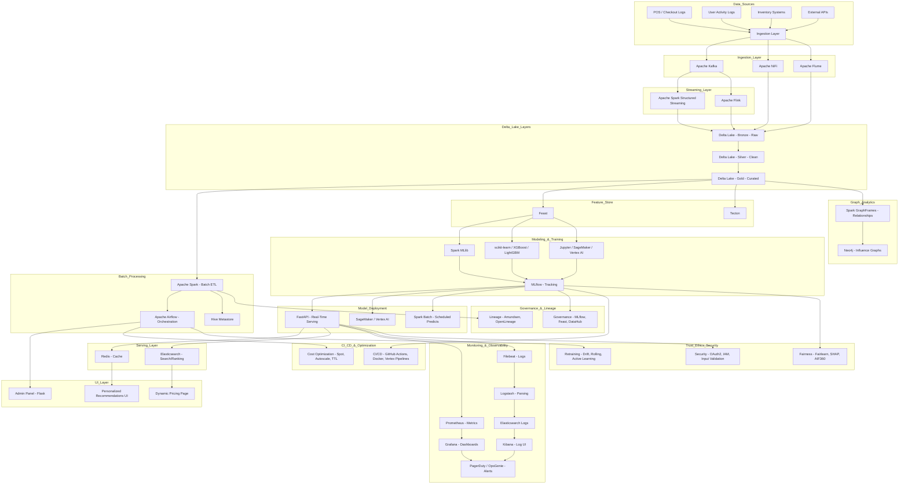
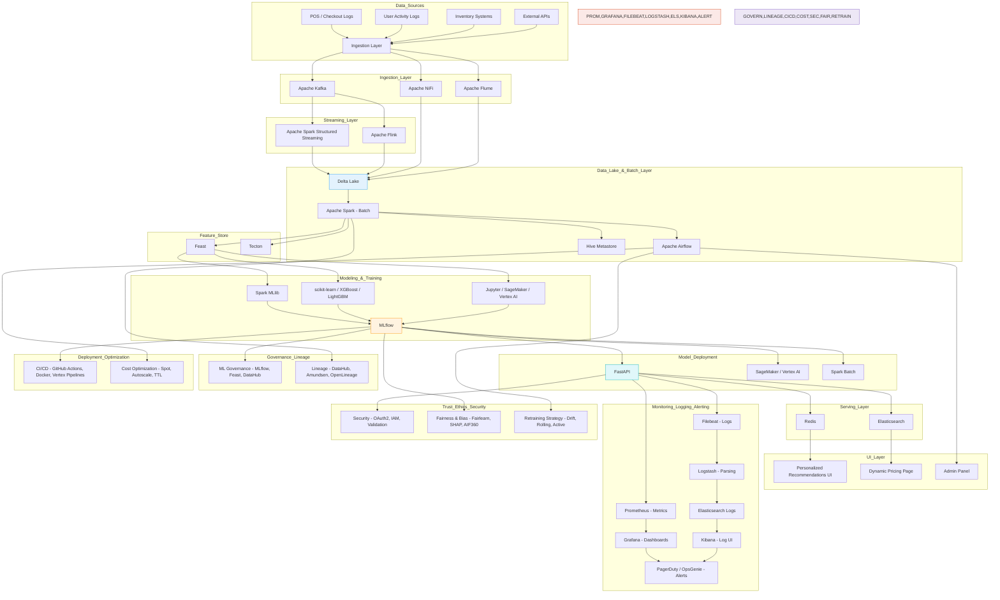

```mermaid
graph TD

%% === Data Sources ===
subgraph Data_Sources
DS1[POS / Checkout Logs] --> IN
DS2[User Activity Logs] --> IN
DS3[Inventory Systems] --> IN
DS4[External APIs] --> IN
end

%% === Ingestion Layer ===
subgraph Ingestion_Layer
IN[Ingestion Layer] --> KAFKA[Apache Kafka]
IN --> NIFI[Apache NiFi]
IN --> FLUME[Apache Flume]
end

%% === Streaming Layer ===
subgraph Streaming_Layer
KAFKA --> STREAM1[Apache Spark Structured Streaming]
KAFKA --> STREAM2[Apache Flink]
end

%% === Data Lake (Delta Bronze/Silver/Gold) ===
subgraph Delta_Lake_Layers
STREAM1 --> DL_BRONZE[Delta Lake - Bronze - Raw]
STREAM2 --> DL_BRONZE
NIFI --> DL_BRONZE
FLUME --> DL_BRONZE
DL_BRONZE --> DL_SILVER[Delta Lake - Silver - Clean]
DL_SILVER --> DL_GOLD[Delta Lake - Gold - Curated]
end

%% === Batch & Metadata ===
subgraph Batch_Processing
DL_GOLD --> BATCH[Apache Spark - Batch ETL]
BATCH --> AIRFLOW[Apache Airflow - Orchestration]
BATCH --> METASTORE[Hive Metastore]
end

%% === Feature Store ===
subgraph Feature_Store
DL_GOLD --> FEAST[Feast]
DL_GOLD --> TECTON[Tecton]
end

%% === ML Modeling & Analytics ===
subgraph Modeling_&_Training
FEAST --> MLLIB[Spark MLlib]
FEAST --> SKLEARN[scikit-learn / XGBoost / LightGBM]
FEAST --> ENV[Jupyter / SageMaker / Vertex AI]
MLLIB --> MLFLOW[MLflow - Tracking]
SKLEARN --> MLFLOW
ENV --> MLFLOW
end

%% === Graph Analytics ===
subgraph Graph_Analytics
DL_GOLD --> GRAPHFRAMES[Spark GraphFrames - Relationships]
GRAPHFRAMES --> NEO4J[Neo4j - Influence Graphs]
end

%% === Model Deployment ===
subgraph Model_Deployment
MLFLOW --> FASTAPI[FastAPI - Real-Time Serving]
MLFLOW --> SMVAI[SageMaker / Vertex AI]
MLFLOW --> SPARKBATCH[Spark Batch - Scheduled Predicts]
end

%% === Serving Layer ===
subgraph Serving_Layer
FASTAPI --> REDIS[Redis - Cache]
FASTAPI --> ES[Elasticsearch - Search/Ranking]
end

%% === UI Layer ===
subgraph UI_Layer
REDIS --> RECOUI[Personalized Recommendations UI]
ES --> PRICEUI[Dynamic Pricing Page]
AIRFLOW --> ADMIN[Admin Panel - Flask]
end

%% === Monitoring, Logging & Alerting ===
subgraph Monitoring_&_Observability
FASTAPI --> PROM[Prometheus - Metrics]
FASTAPI --> FILEBEAT[Filebeat - Logs]
PROM --> GRAFANA[Grafana - Dashboards]
FILEBEAT --> LOGSTASH[Logstash - Parsing]
LOGSTASH --> ELS[Elasticsearch Logs]
ELS --> KIBANA[Kibana - Log UI]
GRAFANA --> ALERT[PagerDuty / OpsGenie - Alerts]
KIBANA --> ALERT
end

%% === Governance & Lineage ===
subgraph Governance_&_Lineage
MLFLOW --> GOVERN[Governance - MLflow, Feast, DataHub]
BATCH --> LINEAGE[Lineage - Amundsen, OpenLineage]
end

%% === CI/CD & Cost Optimization ===
subgraph CI_CD_&_Optimization
MLFLOW --> CICD[CI/CD - GitHub Actions, Docker, Vertex Pipelines]
AIRFLOW --> COST[Cost Optimization - Spot, Autoscale, TTL]
end

%% === Security, Fairness, Retraining ===
subgraph Trust_Ethics_Security
FASTAPI --> SEC[Security - OAuth2, IAM, Input Validation]
MLFLOW --> FAIR[Fairness - Fairlearn, SHAP, AIF360]
AIRFLOW --> RETRAIN[Retraining - Drift, Rolling, Active Learning]
end

```

```mermaid
graph TD

%% === Data Sources ===
subgraph Data_Sources
DS1[POS / Checkout Logs] --> IN
DS2[User Activity Logs] --> IN
DS3[Inventory Systems] --> IN
DS4[External APIs] --> IN
end

%% === Ingestion Layer ===
subgraph Ingestion_Layer
IN[Ingestion Layer] --> KAFKA[Apache Kafka]
IN --> NIFI[Apache NiFi]
IN --> FLUME[Apache Flume]
end

%% === Streaming Layer ===
subgraph Streaming_Layer
KAFKA --> STREAM1[Apache Spark Structured Streaming]
KAFKA --> STREAM2[Apache Flink]
end

%% === Data Lake & Batch Layer ===
subgraph Data_Lake_&_Batch_Layer
STREAM1 --> DL[Delta Lake]
STREAM2 --> DL
NIFI --> DL
FLUME --> DL
DL --> BATCH[Apache Spark - Batch]
BATCH --> AIRFLOW[Apache Airflow]
BATCH --> METASTORE[Hive Metastore]
end

%% === Feature Store ===
subgraph Feature_Store
BATCH --> FEAST[Feast]
BATCH --> TECTON[Tecton]
end

%% === Modeling & Training ===
subgraph Modeling_&_Training
FEAST --> MLLIB[Spark MLlib]
FEAST --> SKLEARN[scikit-learn / XGBoost / LightGBM]
FEAST --> ENV[Jupyter / SageMaker / Vertex AI]
MLLIB --> MLFLOW[MLflow]
SKLEARN --> MLFLOW
ENV --> MLFLOW
end

%% === Model Deployment ===
subgraph Model_Deployment
MLFLOW --> FASTAPI[FastAPI]
MLFLOW --> SMVAI[SageMaker / Vertex AI]
MLFLOW --> SPARKBATCH[Spark Batch]
end

%% === Serving Layer ===
subgraph Serving_Layer
FASTAPI --> REDIS[Redis]
FASTAPI --> ES[Elasticsearch]
end

%% === UI Layer ===
subgraph UI_Layer
REDIS --> RECOUI[Personalized Recommendations UI]
ES --> PRICEUI[Dynamic Pricing Page]
AIRFLOW --> ADMIN[Admin Panel]
end

%% === Monitoring, Logging & Alerting ===
subgraph Monitoring_Logging_Alerting
FASTAPI --> PROM[Prometheus - Metrics]
FASTAPI --> FILEBEAT[Filebeat - Logs]
PROM --> GRAFANA[Grafana - Dashboards]
FILEBEAT --> LOGSTASH[Logstash - Parsing]
LOGSTASH --> ELS[Elasticsearch Logs]
ELS --> KIBANA[Kibana - Log UI]
GRAFANA --> ALERT[PagerDuty / OpsGenie - Alerts]
KIBANA --> ALERT
end

%% === Governance & Lineage ===
subgraph Governance_Lineage
MLFLOW --> GOVERN[ML Governance - MLflow, Feast, DataHub]
BATCH --> LINEAGE[Lineage - DataHub, Amundsen, OpenLineage]
end

%% === CI/CD & Cost Optimization ===
subgraph Deployment_Optimization
MLFLOW --> CICD[CI/CD - GitHub Actions, Docker, Vertex Pipelines]
AIRFLOW --> COST[Cost Optimization - Spot, Autoscale, TTL]
end

%% === Security, Fairness, Retraining ===
subgraph Trust_Ethics_Security
FASTAPI --> SEC[Security - OAuth2, IAM, Validation]
MLFLOW --> FAIR[Fairness & Bias - Fairlearn, SHAP, AIF360]
AIRFLOW --> RETRAIN[Retraining Strategy - Drift, Rolling, Active]
end

%% === Styles ===
style DL fill:#e3f2fd,stroke:#2196f3
style MLFLOW fill:#fff3e0,stroke:#fb8c00
style FASTAPI fill:#e0f7fa,stroke:#00acc1
style PROM,GRAFANA,FILEBEAT,LOGSTASH,ELS,KIBANA,ALERT fill:#fbe9e7,stroke:#d84315
style GOVERN,LINEAGE,CICD,COST,SEC,FAIR,RETRAIN fill:#ede7f6,stroke:#7e57c2
```
