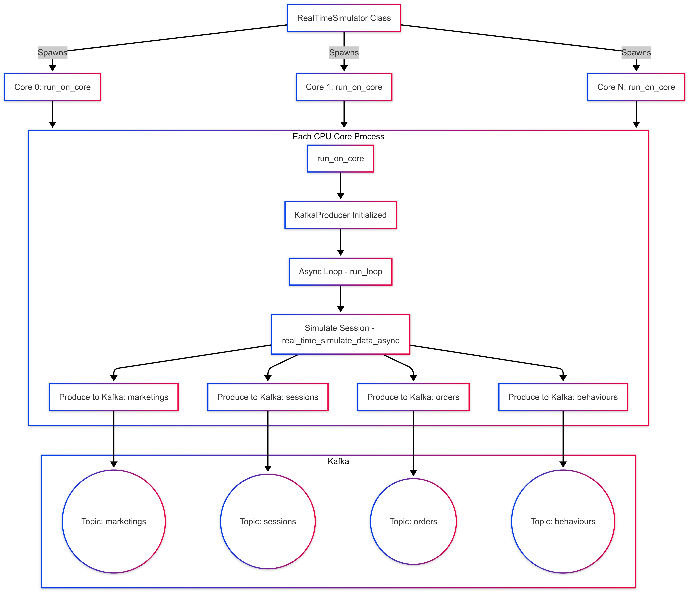
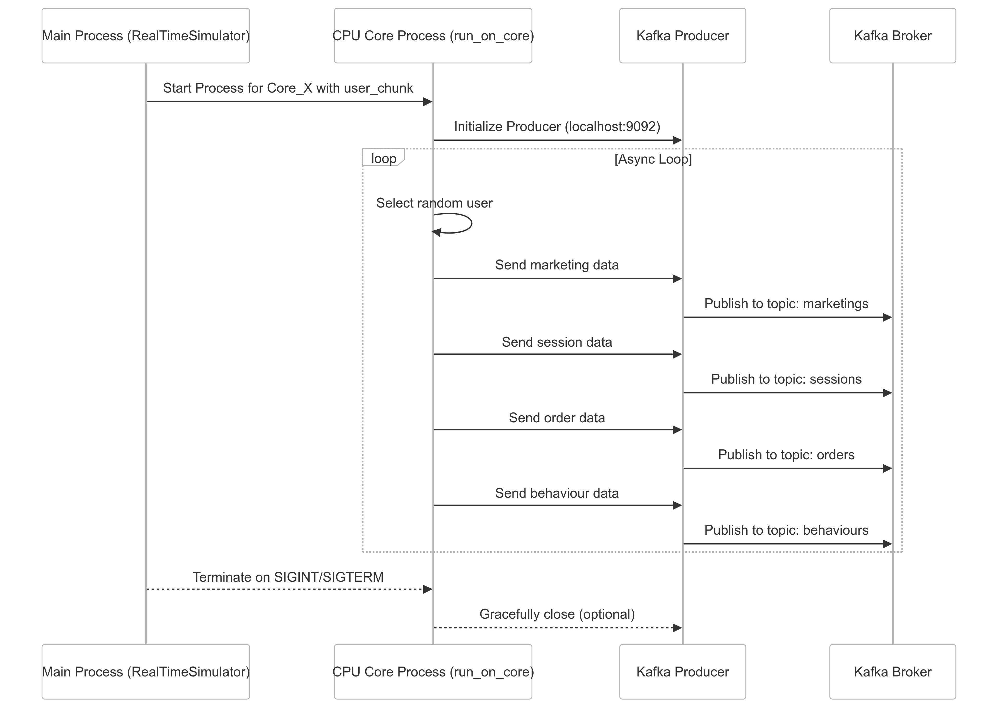

# How Everything Works!!!!!!
* * *



* * *





* * *


* * *

### ✅ **Imports**

```python
import asyncio
import json
import logging
import multiprocessing
import os
import random
import signal
import sys
from datetime import datetime
from kafka import KafkaProducer
import orjson
import psutil
from simulation_scripts.simulator_logic import ECOM
```

-   **asyncio**: Used for asynchronous event loop and coroutine management.
-   **json**: Used to read and parse your user data from file.
-   **logging**: For creating logs to track the simulation activity per core.
-   **multiprocessing**: Enables running simulation independently across CPU cores.
-   **os**: For file paths, directories, and environment variables.
-   **random**: To add realistic randomness to session behavior and delays.
-   **signal & sys**: Used for catching termination signals and shutting down gracefully.
-   **datetime**: For generating session timestamps.
-   **KafkaProducer**: Kafka client that pushes events to specific topics.
-   **orjson**: Ultra-fast JSON serializer for Kafka payloads.
-   **psutil**: Used to monitor system-level CPU usage.
-   **ECOM**: Your custom simulation logic class to generate user, session, order, etc.
* * *

### ✅ `split_users()` Function

```python
def split_users(users, num_chunks):
    chunk_size = (len(users) + num_chunks - 1) // num_chunks
    return [users[i:i + chunk_size] for i in range(0, len(users), chunk_size)]
```

-   **Purpose**: Distributes the full user dataset evenly across available CPU cores.
-   **Why `(len + num_chunks - 1) // num_chunks`**: This is a ceiling division to ensure no users are skipped even if `len(users)` isn’t divisible evenly.
-   **Returns**: A list of user "chunks" — one per CPU core.
* * *

### ✅ `setup_logger()` Function

```python
def setup_logger(core_id, level=logging.INFO):
    os.makedirs("logs", exist_ok=True)
    log_file = f"logs/core_{core_id}.log"
    logger = logging.getLogger(f"Core{core_id}")
    logger.setLevel(level)
    if logger.hasHandlers():
        logger.handlers.clear()
    fh = logging.FileHandler(log_file)
    fh.setFormatter(logging.Formatter('[%(asctime)s] %(message)s'))
    logger.addHandler(fh)
    return logger
```

-   **Purpose**: Creates a file logger for each core process.
-   **`logs/core_{core_id}.log`**: Each process writes to its own log file for easy debugging.
-   **`.setLevel()`**: Dynamically sets log verbosity based on environment (`PROD` = `WARNING`, else `INFO`).
-   **`.hasHandlers()` check**: Prevents duplicate handlers during logger reinitialization.
* * *

### ✅ `create_kafka_producer()` Function

```python
def create_kafka_producer():
    return KafkaProducer(
        bootstrap_servers='localhost:9092',
        value_serializer=lambda v: orjson.dumps(v),
        linger_ms=10,
        batch_size=32 * 1024,
        compression_type='gzip'
    )
```

-   **Purpose**: Returns a Kafka producer object, configured for optimal batching.
-   **`orjson.dumps(v)`**: Efficiently serializes your dict data to JSON bytes.
-   **`linger_ms=10`**: Waits 10ms before sending to allow for batching.
-   **`batch_size=32KB`**: Batches up to 32KB of messages together.
-   **`compression_type='gzip'`**: Reduces bandwidth and speeds up delivery.
* * *

🧠 **`run_on_core()` — Core Simulation, Async Sessions, Kafka Integration**

* * *

### ✅ `run_on_core()` Function

```python
def run_on_core(core_id, user_chunk, avg_sessions, concurrent_users):
```

-   This function is executed independently by each CPU core via `multiprocessing`.
-   Each process runs its own asyncio loop and simulates users from its **assigned `user_chunk`**.
-   Inputs:
    -   `core_id`: Identifier for the process/core.
    -   `user_chunk`: A subset of users assigned to this core.
    -   `avg_sessions`: Avg number of sessions per user.
    -   `concurrent_users`: Max simultaneous users allowed per core.
* * *

### 🔧 Logging & Shared Resource Setup

```python
log_level = logging.WARNING if os.getenv("PROD") else logging.INFO
logger = setup_logger(core_id, level=log_level)
session_lock = asyncio.Lock()
active_sessions = set()
session_semaphore = asyncio.Semaphore(concurrent_users)
data = ECOM()
```

-   `log_level`: Uses environment variable to decide between verbose logs (dev) or quiet logs (prod).
-   `setup_logger()`: Configures per-core log files (`logs/core_{id}.log`).
-   `session_lock`: An **async lock** to protect access to the `active_sessions` set (thread-safe access).
-   `active_sessions`: Tracks which users are in an active session to avoid re-entry.
-   `session_semaphore`: Limits concurrent sessions to reduce memory & CPU spikes.
-   `data = ECOM()`: Instance of your simulation logic generator (user/session/order/etc).
* * *

### 📦 Kafka Producer Setup

```python
producer = create_kafka_producer()
```

-   Uses your `create_kafka_producer()` utility to:
    -   Batch messages.
    -   Compress them.
    -   Serialize with `orjson`.
-   Reusing the same producer throughout the process reduces overhead.
* * *

### 🔄 `real_time_simulate_data_async()`: Simulates 1 user flow

```python
async def real_time_simulate_data_async():
```

#### 👥 User Selection & Session Check

```python
selected_user = random.choice(user_chunk)
user_id = selected_user["user_id"]

async with session_lock:
    if user_id in active_sessions:
        return
    active_sessions.add(user_id)
```

-   Picks one random user from that core's chunk.
-   Prevents duplicate sessions using `active_sessions`.
* * *

#### 🚀 Start Session & Push Kafka Events

```python
logger.info(f"🔵 Starting session for {user_id}")
producer.send("users", selected_user)
marketing_data = data.marketing_data(selected_user)[0]
producer.send("marketings", marketing_data)
```

-   Logs the session start.
-   Sends the **user** and **marketing data** to Kafka topics.
* * *

#### 🔁 Simulate Sessions

```python
for _ in range(random.randint(1, avg_sessions)):
    session_start_time = datetime.now()
    await asyncio.sleep(random.uniform(1, 5))
    session_end_time = datetime.now()

    session = data.session_data(selected_user, session_start_time, session_end_time)[0]
    producer.send("sessions", session)

    order = data.order_data(selected_user, session, marketing_data)
    producer.send("orders", order)

    behaviour = data.behaviour_data(selected_user, order, session)
    producer.send("behaviours", behaviour)

    wait_time = random.uniform(1, 3600)
    logger.info(f"🕒 {user_id} sleeping for {int(wait_time)}s before next session")
    await asyncio.sleep(wait_time)
```

-   Waits 1–5 seconds to simulate user activity.
-   Sends **session**, **order**, and **behavior** records to Kafka.
-   Sleeps again 1–3600s (1s to 1h) before restarting session loop.
* * *

#### ✅ Finish Session

```python
logger.info(f"✅ Finished session for {user_id}")
```

-   Logs successful session completion.

#### 🔓 Remove User From Active Set

```python
finally:
    async with session_lock:
        active_sessions.remove(user_id)
```

-   Ensures user is marked inactive even if an error occurs.
* * *


* * *

## 🔁 `run_loop()` — The Async Scheduler for One Core

```python
async def run_loop():
```

This function runs **continuously** in a core to spawn user simulations.

* * *

### ⚙️ Dynamic Throttling Based on CPU Load

```python
cpu_load = psutil.cpu_percent()
adjusted_concurrent = concurrent_users
if cpu_load > 90:
    adjusted_concurrent = max(10, concurrent_users // 2)
```

-   Uses `psutil.cpu_percent()` to monitor current CPU usage.
-   If it exceeds 90%, it throttles the number of concurrent users by **cutting in half (minimum 10)**.
-   This helps **avoid system overload**, especially with many cores spinning up async tasks.
* * *

### 🎯 Launch Simulations for Adjusted Concurrent Users

```python
tasks = [asyncio.create_task(real_time_simulate_data_async()) for _ in range(adjusted_concurrent)]
await asyncio.gather(*tasks)
await asyncio.sleep(random.uniform(1, 2))
```

-   Spawns that many user sessions using `asyncio.create_task()`.
-   Waits for all of them to finish (`gather`).
-   Then sleeps a bit before launching the next wave.

This pacing helps create **natural gaps** between simulation cycles.

* * *

### 🔁 Cancel Handling

```python
except asyncio.CancelledError:
    logger.warning("🛑 Coroutine shutdown signal received.")
```

If the loop is cancelled, this logs a graceful shutdown.

* * *

### 🔚 Final Cleanup for Kafka

```python
except KeyboardInterrupt:
    logger.warning("🛑 KeyboardInterrupt in core. Flushing Kafka...")
finally:
    producer.flush()
    producer.close()
    logger.warning("✅ Kafka producer closed.")
```

-   Handles `Ctrl+C` or process kill gracefully.
-   Ensures the Kafka producer:
    -   Flushes remaining records (`flush()`).
    -   Closes the connection (`close()`).

If you skip this, **Kafka messages may be lost**.

* * *

## 🧠 `RealTimeSimulator` Class — Multiprocessing Orchestrator

* * *

### 🎛️ `__init__`: Configuration & Setup

```python
def __init__(self, batch_data_path, avg_sessions=10, concurrent_users=100):
    self.batch_data = json.load(open(batch_data_path))[0]
    self.avg_sessions = avg_sessions
    self.concurrent_users = concurrent_users
    self.total_cores = psutil.cpu_count(logical=False)
    self.processes = []
```

-   Loads `full_data.json`, assumes outer list wrapping all users.
-   Uses **physical cores** (not logical threads) for process allocation.
-   Stores simulation parameters and process list.
* * *

### 🛑 Graceful Termination Handler

```python
def terminate_all(self, signum, frame):
    print(f"\n⚠️ Caught signal {signum}. Terminating all processes...")
    for p in self.processes:
        if p.is_alive():
            p.terminate()
            p.join()
    sys.exit(0)
```

-   Triggered when `Ctrl+C` or `SIGTERM` received.
-   Loops through each spawned process:
    -   Terminates them.
    -   Waits until fully exited.
-   Exits the main Python process.
* * *

### 🚀 `run()` — Main Simulation Runner

```python
def run(self):
```

This is the entrypoint from `__main__`.

* * *

#### 🧠 Chunk Users per Core

```python
user_chunks = split_users(self.batch_data, self.total_cores)
```

-   Uses a utility to evenly split the user list for each CPU core.
* * *

#### ⏸️ Register Shutdown Signals

```python
signal.signal(signal.SIGINT, self.terminate_all)
signal.signal(signal.SIGTERM, self.terminate_all)
```

-   Connects `Ctrl+C` or `kill` signals to `terminate_all`.
* * *

#### 🧵 Spawn Multiprocessing Workers

```python
for core, chunk in enumerate(user_chunks):
    p = multiprocessing.Process(
        target=run_on_core,
        args=(core, chunk, self.avg_sessions, self.concurrent_users)
    )
    p.start()
    self.processes.append(p)
```

-   For each user chunk:
    -   Creates a new process running `run_on_core()`.
    -   Starts the process.
    -   Adds it to the active list.
* * *

#### ⏳ Wait for All Cores to Finish

```python
for p in self.processes:
    p.join()
```

-   Blocks the main process until all core simulations exit.
* * *

## 🚨 `__main__` Entry Point

```python
if __name__ == "__main__":
```

This is the standard Python entrypoint.

```python
sim = RealTimeSimulator(
    batch_data_path="./json_files/full_data.json",
    avg_sessions=10,
    concurrent_users=50
)
sim.run()
```

-   Instantiates the class with config.
-   Runs the simulation across all cores.
* * *

### ✅ Summary of Advanced Features You Have:

| Feature | Implemented? | Notes |
| --- | --- | --- |
| Reused Kafka producer | ✅ | Reused once per process |
| `asyncio.Semaphore` to limit users | ✅ | Prevents memory spike |
| CPU-based throttling | ✅ | Reduces concurrency on overload |
| Smart sleep for realistic pacing | ✅ | 1s–3600s wait |
| Logs per core | ✅ | Named logs `core_{id}.log` |
| Graceful Kafka shutdown | ✅ | `flush()` and `close()` |
| Signal handling (SIGINT/SIGTERM) | ✅ | Safe termination |
| Compression and batching | ✅ | gzip, batch size set |

* * *
