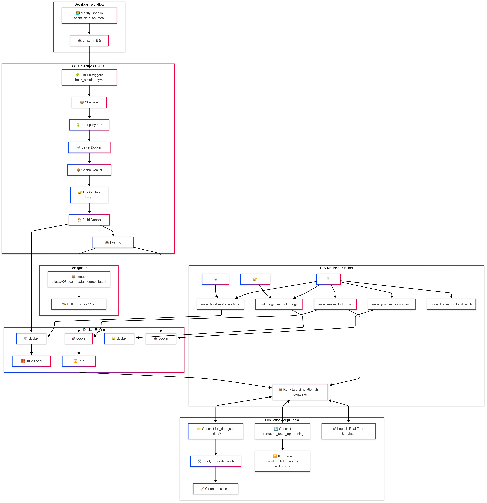

* * *

### ✅ **PART 1: The Big Picture — How Everything Fits Together**

#### 📦 Components in Your Setup:

| Component | Purpose |
| --- | --- |
| `start_simulation.sh` | Shell script to orchestrate simulation steps locally or in container |
| `Dockerfile` | Containerizes the microservice |
| `Makefile` | Provides CLI interface to build/run/push Docker image |
| `.github/workflows/` | GitHub Actions CI/CD pipeline: auto-build and push image to DockerHub |
| `.env.secrets` | Keeps sensitive credentials (like DockerHub login) out of source control |

* * *

### 🔁 **High-Level Flowchart**

```plaintext
                         🧑 Dev pushes code to GitHub
                                  │
                                  ▼
                       🔁 GitHub Actions Triggered
                                  │
         ┌────────────────────────────────────────────┐
         │ Checkout → Set up Python & Docker → Login  │
         │  → Build Docker Image → Push to DockerHub  │
         └────────────────────────────────────────────┘
                                  │
                                  ▼
                 🐳 Updated container on DockerHub

                 (Alternatively, run locally with...)
                                  │
                    make run → docker run → Dockerfile
                                  │
                                  ▼
                🔁 start_simulation.sh (inside container)
                  ├─ if JSON doesn't exist → batch simulation
                  ├─ background API simulator
                  └─ run real-time simulator
```

* * *


## 🔹 PART 2: `start_simulation.sh` — Local + Container Brain

This script runs **inside the container** (or locally) and acts like the **brains of the simulation microservice**. It decides:

-   When to generate fresh data
-   When to clean logs
-   When to run the external API fetcher
-   When to launch the real-time simulator
* * *

### 🧾 **Full Script Recap**

```bash
#!/bin/bash
set -e  # Exit on any error

# Step 1: Check if JSON already exists
if [ ! -f ./json_files/full_data.json ]; then
  echo "🛠 Generating batch data..."
  python3 -m pos_logs.unified_simulator --mode batch --count 10000 --avg_sessions 10
  echo "🧹 Cleaning session logs..."
  rm -f ./logs/session_logs/core.*
fi

# Step 2: Run external API fetcher in background if not running
if ! pgrep -f promotion_fetch_api_request.py > /dev/null; then
  echo "🔄 Starting promotion fetch API in background..."
  nohup python3 -m external_apis.promotion_fetch_api_request > ./logs/promotion.log 2>&1 &
fi

# Step 3: Start real-time simulation
echo "🚀 Launching real-time simulator..."
python3 -m pos_logs.unified_simulator --mode realtime --output stdout --avg_sessions 2 --concurrent_users 10
```

* * *

## 🔍 Line-by-Line Breakdown

| Line | What it Does |
| --- | --- |
| `#!/bin/bash` | Declares this as a bash script |
| `set -e` | Terminates the script immediately if any command fails (important for CI) |

* * *

### ✅ Step 1: Batch JSON Generation

```bash
if [ ! -f ./json_files/full_data.json ]; then
```

-   Check if simulation data already exists
-   If not, generate synthetic data using:

```bash
python3 -m pos_logs.unified_simulator --mode batch --count 10000 --avg_sessions 10
```

🔧 _This is a Python module command that triggers the `BatchDataSimulator`_

Then clean stale logs:

```bash
rm -f ./logs/session_logs/core.*
```

* * *

### 🔄 Step 2: Launch API Simulator (Only If Not Running)

```bash
if ! pgrep -f promotion_fetch_api_request.py > /dev/null; then
```

-   Uses `pgrep` to check if the promotion fetch script is already running
-   If not, it runs the script **in the background** with `nohup`

```bash
nohup python3 -m external_apis.promotion_fetch_api_request > ./logs/promotion.log 2>&1 &
```

🧠 This simulates real-time ingestion of promotions fetched from an external API.

* * *

### 🚀 Step 3: Real-Time Simulation

```bash
python3 -m pos_logs.unified_simulator --mode realtime ...
```

This launches the real-time async/multiprocess simulator using a JSON file of users.

* * *

## 💡 Why This Script is Powerful

-   Ensures **fresh data** is generated only when needed
-   Manages **background jobs** like API fetchers
-   Launches **real-time simulators** to Kafka or stdout
-   Makes your microservice **container-ready and automation-friendly**
* * *

## 💬 Example Use Cases

| Scenario | Result |
| --- | --- |
| You run `make run` | It uses Dockerfile’s `CMD ["bash", "start_simulation.sh"]` to run this script |
| In CI/CD | This script gets run inside the container GitHub Actions builds and pushes |
| You want a new batch of data | Just delete the JSON and rerun `make run` |

* * *


## 🔸 PART 3: `Dockerfile` – Build Your Data Microservice

Here’s the full file again for context:

```dockerfile
# Use lightweight Python image
FROM python:3.11-slim

# Set working directory inside container
WORKDIR /app

# Copy everything into the container's /app
COPY . /app

# Tell Python where to find your modules
ENV PYTHONPATH="/app"

# Install dependencies
RUN pip install --upgrade pip && pip install -r requirements.txt

# Default command to run on `docker run`
CMD ["bash", "start_simulation.sh"]
```

* * *

## 🔍 Step-by-Step Breakdown

### ✅ `FROM python:3.11-slim`

-   This is your **base image**.
-   It's a minimal Python image (~22MB) → faster builds, smaller size.

> Think of it like: _"Start with a clean machine that has Python 3.11 installed."_

* * *

### ✅ `WORKDIR /app`

-   Sets the default directory inside the container.
-   All next commands (like `COPY`, `RUN`, `CMD`) happen **inside `/app`**.
-   Equivalent to doing `cd /app` in Linux.
* * *

### ✅ `COPY . /app`

-   Copies all files from your **host's `ecom_data_sources/` directory** into the container at `/app`.

📦 Example:

| Host | Becomes inside container |
| --- | --- |
| `ecom_data_sources/pos_logs/` | `/app/pos_logs/` |
| `ecom_data_sources/requirements.txt` | `/app/requirements.txt` |

* * *

### ✅ `ENV PYTHONPATH="/app"`

This is **super important**. Without this line:

```python
from pos_logs.unified_simulator import ...
```

… would **fail**, because Python wouldn’t know where to find `pos_logs`, `simulation_scripts`, etc.

By setting `PYTHONPATH`, we’re saying:

> “Treat `/app` as the root of the Python module search path.”

* * *

### ✅ `RUN pip install --upgrade pip && pip install -r requirements.txt`

-   First, we upgrade pip.
-   Then install all dependencies from `requirements.txt`.

🎯 This creates a **layered cache** in Docker:

-   If your requirements don’t change, it doesn’t reinstall everything again.
-   Saves build time!
* * *

### ✅ `CMD ["bash", "start_simulation.sh"]`

This is the **entrypoint**.

When you do:

```bash
docker run ecom_data_sources:latest
```

…it will automatically execute:

```bash
bash start_simulation.sh
```

Which:

1.  Generates data if needed
2.  Starts API fetcher
3.  Starts real-time Kafka simulation
* * *

## 💬 Real-World Analogy

> Dockerfile is like a recipe (blueprint) to bake a cake (your microservice image) that has your logic (`start_simulation.sh`), ingredients (`requirements.txt`), and behavior (`CMD`).

* * *

## 🔁 Typical Dev Flow

| Action | What Happens |
| --- | --- |
| `make build` | Uses `Dockerfile` to create an image locally |
| `make run` | Starts container which runs `start_simulation.sh` |
| GitHub Workflow | Executes `docker build` inside CI and pushes to DockerHub |

* * *


## 🔹 PART 4: `Makefile` – Automating Everything with Simple Commands

A `Makefile` lets you run complex Docker and local dev commands with just:

```bash
make build
make run
make push
```

### 📄 Your `ecom_data_sources/Makefile`:

```makefile
-include .env.secrets

IMAGE_NAME=ecom_data_sources
TAG=latest
DOCKERHUB_USERNAME=tejasjay03

.PHONY: help build run push login test

help:
        @echo "Targets:"
        @echo "  build        - Build Docker image"
        @echo "  run          - Run the container locally"
        @echo "  login        - Docker login to DockerHub"
        @echo "  push         - Push to DockerHub"
        @echo "  test         - Run simulation locally with Python"

login:
        docker login -u $(DOCKERHUB_USERNAME) -p $(DOCKERHUB_PASSWORD)

build:
        docker build -t $(IMAGE_NAME):$(TAG) .

run:
        docker run --rm -it $(IMAGE_NAME):$(TAG)

push: build
        docker tag $(IMAGE_NAME):$(TAG) $(DOCKERHUB_USERNAME)/$(IMAGE_NAME):$(TAG)
        docker push $(DOCKERHUB_USERNAME)/$(IMAGE_NAME):$(TAG)

test:
        python3 -m pos_logs.unified_simulator --mode batch --count 10

batch:
        docker run --rm -it ecom_data_sources:latest python3 -m pos_logs.unified_simulator --mode batch --count 1000 --avg_sessions 10

realtime:
        docker run --rm -it ecom_data_sources:latest python3 -m pos_logs.unified_simulator --mode realtime --output stdout --avg_sessions 10 --concurrent_users 500

check-secrets:
        @if [ ! -f .env.secrets ]; then \
                echo "❌ .env.secrets file not found!"; \
                exit 1; \
        else \
                echo "✅ secrets loaded from .env.secrets "; \
        fi
```

* * *

## 🧠 What Each Section Does

### ✅ `-include .env.secrets`

-   This **includes your secrets file** with DockerHub credentials:

```makefile
DOCKERHUB_USERNAME=tejasjay03
DOCKERHUB_PASSWORD=your_dockerhub_token
```

-   So you can use `$(DOCKERHUB_USERNAME)` and `$(DOCKERHUB_PASSWORD)` directly.
* * *

### ✅ Variable Section

```makefile
IMAGE_NAME=ecom_data_sources
TAG=latest
```

-   These help reuse values across the Makefile instead of hardcoding.
-   Want to version it? Just change `TAG=1.0.1`.
* * *

### ✅ `.PHONY`

```makefile
.PHONY: build run push
```

-   Prevents conflicts with real file names.
-   You’re saying: “These are **commands**, not actual files.”
* * *

## 🛠 Commands You Can Run

### 🔹 `make build`

```makefile
docker build -t ecom_data_sources:latest .
```

-   Runs your Dockerfile and builds the image locally.
* * *

### 🔹 `make run`

```makefile
docker run --rm -it ecom_data_sources:latest
```

-   Runs your image (which will trigger `start_simulation.sh` inside Docker).
* * *

### 🔹 `make login`

```makefile
docker login -u tejasjay03 -p your_dockerhub_token
```

-   Logs into DockerHub using creds in `.env.secrets`.
* * *

### 🔹 `make push`

```makefile
docker tag ecom_data_sources:latest tejasjay03/ecom_data_sources:latest
docker push tejasjay03/ecom_data_sources:latest
```

-   Pushes the image to your DockerHub repository.
* * *

### 🔹 `make test`

-   Runs a quick local batch simulation to verify logic.

### 🔹 `make batch` / `make realtime`

-   For advanced, mode-specific Docker testing.
* * *

### 🧪 Real-Life Example Workflow

| Task | Run This | What Happens |
| --- | --- | --- |
| You make a code change | `make build` | Docker image is rebuilt |
| You want to test locally | `make run` | Container starts |
| You want to publish | `make push` | Image gets pushed to DockerHub |
| You want to automate | GitHub runs `docker build` + `docker push` via CI |  |

* * *


## 🔹 PART 6: `.github/workflows/build_simulator.yml` – Automated Build & Push with Every Git Push

This file triggers **automated Docker builds and pushes** to DockerHub every time code changes inside your `ecom_data_sources` microservice.

* * *

### 📄 Your Current Workflow:

```yaml
name: Build & Push Data Sources Microservice

on:
  push:
    paths:
      - 'ecom_data_sources/**'
      - '.github/workflows/build_simulator.yml'

  workflow_dispatch:

jobs:
  build-push:
    runs-on: ubuntu-latest

    steps:
      - name: Checkout Code
        uses: actions/checkout@v3

      - name: Set up Python
        uses: actions/setup-python@v4
        with:
          python-version: 3.11

      - name: Set up Docker Buildx
        uses: docker/setup-buildx-action@v3

      - name: Cache Docker layers
        uses: actions/cache@v3
        with:
          path: /tmp/.buildx-cache
          key: buildx-${{ github.sha }}

      - name: Docker Login
        uses: docker/login-action@v2
        with:
          username: ${{ secrets.DOCKERHUB_USERNAME }}
          password: ${{ secrets.DOCKERHUB_TOKEN }}

      - name: Build and Push Docker Image
        run: |
          cd ecom_data_sources
          docker build -t ${{ secrets.DOCKERHUB_USERNAME }}/ecom_data_sources:latest .
          docker push ${{ secrets.DOCKERHUB_USERNAME }}/ecom_data_sources:latest
```

* * *

## 💡 Why This Workflow Matters

| Feature | Purpose |
| --- | --- |
| `on: push` | Triggers on changes to your microservice or the workflow file |
| `workflow_dispatch` | Allows manual runs from GitHub UI |
| `checkout@v3` | Pulls your code onto the GitHub runner |
| `setup-python` | Ensures Python (for pip install, etc.) is available |
| `docker/setup-buildx-action` | Enables faster Docker builds with caching |
| `actions/cache` | Speeds up rebuilds by reusing previous layers |
| `docker/login-action` | Logs into DockerHub securely using **GitHub Secrets** |
| `docker build & push` | Your microservice gets built and deployed automatically |

* * *

## 🔒 Secrets Setup

These values come from **GitHub → Settings → Secrets and variables → Actions**:

| Secret Name | Value |
| --- | --- |
| `DOCKERHUB_USERNAME` | `tejasjay03` |
| `DOCKERHUB_TOKEN` | \[your DockerHub token\] |

**Tip**: You can generate a Docker token here:
👉 [https://hub.docker.com/settings/security](https://hub.docker.com/settings/security)

* * *

## 🔁 End-to-End Flow

```text
                 You make a change
                         ⬇
           GitHub detects the change via `on: push`
                         ⬇
       GitHub Actions spins up a runner (ubuntu-latest)
                         ⬇
     Code is checked out & Docker image is built
                         ⬇
       Docker image is pushed to DockerHub registry
                         ⬇
        Ready to be deployed via Kubernetes or Compose
```

* * *

## 🧪 Test It Yourself

Try pushing a small change inside `ecom_data_sources/unified_simulator.py` and push:

```bash
git add .
git commit -m "trigger CI"
git push origin main
```

Then go to **GitHub → Actions tab** and watch your workflow go green ✅.

* * *

# 🧩 PART 7: **Complete Flowchart + Developer Cheat Sheet**

This part stitches together everything you’ve built into a visual and conceptual overview. After this, you’ll _fully understand how your `ecom_data_sources` microservice_ works end-to-end with automation, containerization, and deployment in mind.

* * *


## 🧰 **A. DEVELOPER CHEAT SHEET — Commands & Roles**

| File | Role | When You Use It |
| --- | --- | --- |
| `start_simulation.sh` | 💥 Orchestration Script: Batch → API fetch → Realtime | Gets executed in container by Dockerfile’s `CMD` |
| `Dockerfile` | 📦 Container Blueprint | `make build` or GitHub Action |
| `Makefile` | 🧰 Developer Commands | Run `make build`, `make run`, `make push`, `make test` |
| `.github/workflows/build_simulator.yml` | 🤖 CI/CD Automation | Triggered on push; builds + pushes to DockerHub |
| `.env.secrets` | 🔐 Sensitive Info (not committed) | Used locally to login with `make login` |

* * *

## 🏗️ **B. Directory + Execution Plan**

```
ecom_data_sources/
├── Dockerfile             → Container blueprint
├── Makefile               → Dev interface (build/run/push)
├── start_simulation.sh    → Script that drives simulation logic
├── requirements.txt       → All Python deps
├── pos_logs/
│   └── unified_simulator.py → Main simulator code (batch + realtime)
├── external_apis/
│   └── promotion_fetch_api_request.py → Background API job
├── simulation_scripts/
│   └── simulator_logic.py → Data generation logic
├── logs/                  → Runtime logs
├── json_files/            → Batch output
```

* * *

## 🔄 **C. Example Flow (Dev → CI/CD → Deployment)**

### 1\. 👨‍💻 Local Dev

```bash
cd ecom_data_sources
make build     # Builds Docker container
make run       # Runs container locally
make push      # (After login) pushes image to DockerHub
```

### 2\. 🔁 GitHub Triggered CI/CD

```bash
# Modify and push
git add .
git commit -m "new batch logic"
git push origin main

# GitHub Actions:
# → builds Docker image
# → pushes to DockerHub
```

### 3\. 🚀 Deployment

That pushed image (`tejasjay03/ecom_data_sources:latest`) can now be pulled by:

-   Your Kubernetes YAML
-   Docker Compose stack
-   Orchestrated Airflow DAG
-   ANY infra that supports containers
* * *

## 🎁 Bonus: Use Cases Across Teams

| Team | Usage |
| --- | --- |
| **Data Eng** | Simulate traffic for pipeline QA |
| **ML Eng** | Train/test new models on synthetic data |
| **DevOps** | Preload production with test events |
| **Security** | Red team testing of fraud flows |
| **Marketing** | Simulate campaign triggers |
| **SRE** | Load testing + pipeline drift detection |

* * *


